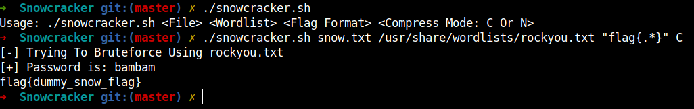
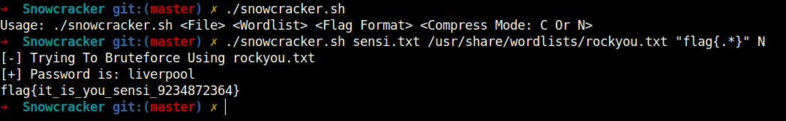

# Snowcracker
**Snowcracker** is a bash script to brute force the password required by stegsnow.

**stegsnow** is a whitespace steganography tool for concealing messages in text files by appending tabs and spaces on the end of lines, for extracting messages from files containing hidden messages you can use it without any flags or if the file is protected by password you can use _snowcracker_ to brute force this password.

---

# Getting Started
```
$ git clone https://github.com/m1m0n/Snowcracker.git
$ cd Snowcracker/
$ chmod +x snowcracker.sh   
$ sudo cp snowcracker.sh /usr/local/bin/ #optional
```

---

# Installation
```bash
$ sudo apt-get install stegsnow
```

---

# Usage
```
Usage: ./snowcracker.sh <File> <Wordlist> <Flag Format> <Compress Mode: C Or N>
```

---

# Examples
In This One I Have used **-C** option to uncompress the data when extracting.




Another Example without using **-C**



